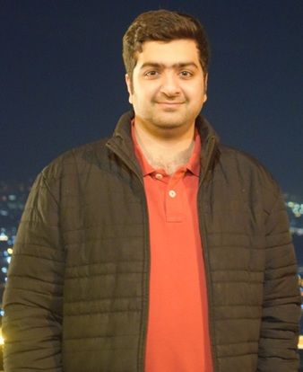

# Hello, Hamza here, it's very nice to meet you

{align=right}

I am a **Mechatronics Engineer**. I spend my time in code scripts or parts documentations. Always excited for a new challenge.

---

Quick Overview of my skills are as such:  

| Groups                     | Tools                                         |
| :------------------------- | :-------------------------------------------- |
| Programming Languages      | C++, Python, Verilog, Linux                   |
| Computer Aided Engineering | ANSYS, FreeCAD, MATLAB, Altium, KiCAD, Docker |
| Team Collaboration         | ZOOM, Microsoft Teams                         |
| Documentation`             | Git, GitHub, LaTeX, Office Suite              |

---

# Links

- GitHub: https://github.com/yourusername
- LinkedIn: https://www.linkedin.com/in/yourusername
